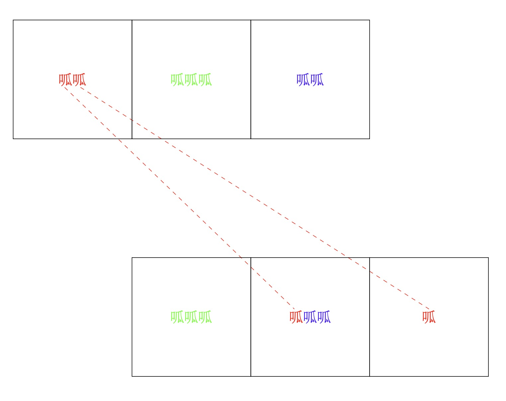

# A frog's trip

A row of $$n$$ squares contains a frog in the leftmost square. By successive jumps the frog goes to the rightmost square and then back to the leftmost square. On the outward trip he jumps one, two or three squares to the right, and on the homeward trip he jumps to the left in a similar manner. He cannot jump outside the squares. He repeats the round-trip travel $$m$$ times.

Let $$F(m, n)$$ be the number of the ways the frog can travel so that at most one square remains unvisited.
For example, $$F(1, 3) = 4$$, $$F(1, 4) = 15$$, $$F(1, 5) = 46$$, $$F(2, 3) = 16$$ and $$F(2, 100) \bmod 10^9 = 429619151$$.

Find the last $$9$$ digits of $$F(10, 10^{12})$$.

# 翻译

在一行 $$n$$ 个方块的最左边一个上有一只青蛙。青蛙通过连续不断的跳跃，先跳到最右边的方块，然后再跳回最左边的方块。它向右跳的时候每次可以跳一个、两个或三个方块，跳回来时也同理。它不能跳出这些方块。这样的往返它一共进行了 $$m$$ 次。

记 $$F(m, n)$$ 为青蛙在过程中至多有一个方块从未被跳到过的方式总数。
例如，$$F(1, 3) = 4$$ , $$F(1, 4) = 15$$ , $$F(1, 5) = 46$$ , $$F(2, 3) = 16$$ ，而 $$F(2, 100) mod 10^9 = 429619151$$ 。

求 $$F(10, 10^{12})$$ 的最后 $$9$$ 位数字。

# 题解

## hint1

一只青蛙来回跳一次 和 两只青蛙跳过去没有区别。

## hint2

青蛙最多可以跳 $$3$$ 格，所以，可以视为所有的青蛙在长度为 $$3$$ 的窗口里面做转移。

## 我的解法

原题不妨看成 $$2m$$ 只青蛙从方格 $$1$$ 跳到 方格 $$n$$ ，其中至多有一个方格没有被占过的方案数。且青蛙和青蛙之间是相互独立且不同的。

因为青蛙一次最多跳三格，所以不妨令所有的青蛙在一个长度为 $$3$$ 的方格里面做滑动窗口。

然后两个划窗中间认为是一次跳跃过去的，转移的方案数就是最左侧的青蛙跳动的方案数。

这样描述可能不太直观，我们举个例子。

如下图所示，假设初始状态有 $$7$$ 只青蛙，某一种情况是在方格 $$x+1$$ 里面有两只青蛙，方格 $$x+2$$ 里面有三只青蛙，方格 $$x+3$$ 里面有两只青蛙。我们标记状态为 $$(2, 3, 3)$$



往下一个方格转移的时候，存在一种情况是方格 $$x+1$$ 的两只青蛙分别跳到了方格 $$x+3$$ 和 $$x+4$$，我们标记状态为 $$(3, 3, 1)$$，至此我们得到了一个可行的转移方式。

上面我们描述了这个 【划窗】 的过程，下面来推导可行状态和转移方程。

### 可行状态

由于题意里面存在一个限制条件：至多有一个方块从未被跳到。

所以上述的状态还需要额外加一个维度是否存在过一个方块没被跳到过。所以我们定义状态为一个四元组 $$(cnt_1, cnt_2, cnt_3, skip)$$ ，表示在  $$x+1, x+2, x+3$$ 方格上青蛙的数量，skip 表示到当前这个状态是否有一个方格没被跳到过。

那么怎么定义跳过的状态呢？

我们定义，当 $$cnt_1 = 0$$ 的时候，认为跳过了一个当前这个方块。

支持我们可以通过枚举方格上青蛙的数量来枚举方案数。

### 转移方程

下面考虑 $$(cnt_1, cnt_2, cnt_3, skip_0)$$ 往 $$(cnt_4, cnt_5, cnt_6, skip_1)$$ 转移。

首先我们要去掉所有不可能的转移：

- $$skip_0 = 1, skip_1 = 0$$，原因是之前跳过了，认为当前也跳过了。不可能从跳过往不跳过转移。
- $$skip_0 = 1, skip_1 = 1, cnt_4 = 0$$，按照之前的假设，$$cnt_4$$ 表示当前跳过了一个方格，而之前已经跳过了一个方格，这样就跳过了两个方格，这是不满足题目要求的。
- $$skip_0 = 0, skip_1 = 1, cnt_4 != 0$$，之前没有跳过，现在变成跳过了，但是实际上 $$cnt_4 != 0$$ 说明当前没跳过，这是不合理的。
- $$cnt_2 > cnt_4 || cnt_3 > cnt_5$$，因为 $$cnt_4$$ 是 $$cnt_2$$ 加上一部分的 $$cnt_1$$ ，不可能变小，$$cnt_3$$ 和 $$cnt_5$$ 同理。

然后就是剩下所有合理的方案，怎么计算转移呢？

实际上就是 $$cnt_1$$ 跳到了后面的三个方格。也即 $$cnt_1 = (cnt_4 - cnt_2) + (cnt_5 - cnt_3) + cnt_6$$。

所以转移的方案数就是 $$C_{cnt_1}^{cnt_6} * C_{cnt_1-cnt_6}^{cnt_5-cnt_3}$$

### 复杂度分析

首先来分析状态数的可能有多少种。

由于我们用四元组表示状态，并且我们有 $$cnt_1 + cnt_2 + cnt_3 = $$ 青蛙数量（设为 $$n$$，题目里面是 $$20$$ ）。所以这个三元组一共会有 $$\cfrac{n*(n+1)}{2}$$ 种可能。对于 skip ，由于至多能跳过一个，所以skip为bool即可，枚举有 $$2$$ 种可能。所以状态机至多有 $$n*(n+1)$$ 种可能。

这里的状态转移，我们可以用一个 $$(n*(n+1)) * (n*(n+1))$$ 的矩阵表示。所以总复杂度为 $$log_2(step) * (n*(n+1))^3$$，其中 $$n = 20, step = 10^{12}$$。

## code

### cpp

```cpp
#include <iostream>
#include <map>
#include <vector>
using namespace std; 
const long long mod = 1e9;
vector<vector<int>> conditions;
map<vector<int>, int> m;
long long c[30][30];

void init_c() {
    for (int i = 0; i < 30; i++) {
        for (int j = 0; j <= i; j++) {
            if (j == 0 || j == i)
                c[i][j] = 1;
            else
                c[i][j] = (c[i - 1][j] + c[i - 1][j - 1]) % mod;
        }
    }
}

void add_condition(vector<int> &v) {
    m[v] = conditions.size();
    conditions.push_back(v);
}
void gen_condition(int guagua_cnt) {
    for (int i = 0; i <= guagua_cnt; i++) {
        for (int j = 0; i + j <= guagua_cnt; j++) {
            if (i == 0 && j == 0)
                continue;
            vector<int> buf(4);
            buf[0] = i;
            buf[1] = j;
            buf[2] = guagua_cnt - i - j;
            buf[3] = (buf[0] == 0 ? 1 : 0);
            add_condition(buf);
            if (buf[3] == 0) {
                buf[3] = 1;
                add_condition(buf);
            }
        }
    }
}

long long cal(vector<int> &a, vector<int> &b) {
    if (a[3] == 1 && b[3] == 0)
        return 0;
    if (a[3] == 1 && b[3] == 1 && b[0] == 0)
        return 0; // 已经有一列为空了，那么新增的列不能为空
    if (a[3] == 0 && b[3] == 1 && b[0] != 0)
        return 0; // 之前一列不为空，当前这一列也不为空，不可能变成空
    // a[0] a[1] a[2]
    //      b[0] b[1] b[2]
    if (b[0] < a[1] || b[1] < a[2])
        return 0;
    long long ans1 = c[a[0]][b[2]];
    long long ans2 = c[a[0] - b[2]][b[1] - a[2]];
    return ans1 * ans2 % mod;
}

vector<vector<long long>> gen_base_matrix() {
    int length = conditions.size();
    vector<vector<long long>> matrix(length);
    for (int i = 0; i < length; i++)
        matrix[i] = vector<long long>(length);
    for (int i = 0; i < length; i++) {
        for (int j = 0; j < length; j++) {
            matrix[i][j] = cal(conditions[i], conditions[j]);
        }
    }
    return matrix;
}

vector<vector<long long>> mul(const vector<vector<long long>> &a, const vector<vector<long long>> &b) {
    vector<vector<long long>> ret(a.size());
    for (int i = 0; i < a.size(); i++)
        ret[i] = vector<long long>(a[0].size(), 0);
    for (int i = 0; i < a.size(); i++) {
        for (int j = 0; j < a[0].size(); j++) {
            for (int k = 0; k < b[0].size(); k++) {
                ret[i][k] = (ret[i][k] + a[i][j] * b[j][k] % mod) % mod;
            }
        }
    }
    return ret;
}

vector<vector<long long>> qpow(vector<vector<long long>> v, long long power) {
    vector<vector<long long>> ret(v.size());
    for (int i = 0; i < v.size(); i++) {
        ret[i]    = vector<long long>(v[0].size(), 0);
        ret[i][i] = 1;
    }
    while (power) {
        if (power & 1)
            ret = mul(ret, v);
        v = mul(v, v);
        power >>= 1;
    }
    return ret;
}

void F(int guagua_cnt, long long length) {
    conditions.clear();
    m.clear();

    guagua_cnt *= 2; // 来回看成两个青蛙
    length--;
    gen_condition(guagua_cnt);
    auto base = gen_base_matrix();
    base      = qpow(base, length);

    vector<int> ans1(4);
    ans1[0] = guagua_cnt;
    ans1[1] = ans1[2] = 0;
    ans1[3]           = 0;

    vector<int> ans2(4);
    ans2[0] = guagua_cnt;
    ans2[1] = ans2[2] = 0;
    ans2[3]           = 1;

    cout << "F(" << guagua_cnt / 2 << ", " << length + 1 << ") = " << (base[m[ans1]][m[ans1]] + base[m[ans1]][m[ans2]]) % mod << endl;
}

int main() {
    init_c();
    F(1, 3);
    F(1, 4);
    F(1, 5);
    F(2, 3);
    F(2, 100);
    F(10, 1e12);
    return 0;
}
```
